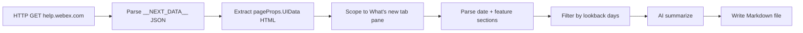

# webscraper
Exploring python web scraping for product roadmap / updates

---
todos:
  - id: scaffold-project
    status: completed
    content: 'Add pyproject.toml, package layout, .env.example, gitignore output/'
  - id: implement-fetcher
    status: completed
    content: Implement __NEXT_DATA__/UIData extraction in fetcher.py
  - id: implement-parser
    status: completed
    content: Parse What's new tab into ReleaseFeature objects with date/format edge cases
  - id: implement-filter
    status: completed
    content: Add lookback-days filter with --days CLI arg and optional --as-of override
  - id: implement-summarizer
    status: completed
    content: LLM summarization + markdown report writer with front matter
  - id: implement-cli
    status: completed
    content: 'Typer CLI with --url, --days, --output, --dry-run, env config'
  - id: add-tests
    status: completed
    content: Fixture-based parser/filter tests; update README with usage
name: Webex release scraper
overview: 'Build a Python CLI that scrapes the Webex Contact Center admin "What''s new" page from embedded Next.js HTML, filters releases by a configurable lookback window (--days), uses an LLM to summarize them, and writes a consolidated Markdown report.'
isProject: false
---
# Webex Contact Center Release Scraper

## Goal

Create a Python tool in this greenfield repo ([README.md](README.md)) that:

1. Fetches [What's new for administrators in Webex Contact Center](https://help.webex.com/en-us/article/nv7abhz/What's-new-for-administrators-in-Webex-Contact-Center)
2. Extracts release entries (date + feature title + body text)
3. Keeps only entries whose **release date falls within a configurable lookback window** (CLI `--days`)
4. Sends those entries to an AI model for summarization/consolidation
5. Writes a **Markdown report** to disk

## Key findings from page analysis

The page is a Next.js app, but **does not require Playwright**. The full article HTML is embedded server-side in `__NEXT_DATA__`:



**Content structure (important for parsing):**

- The active "What's new" tab is `#topic_D1C27F9C842A4C6CA27898AFFDB474B7` (matches your URL anchor).
- Release dates appear as headings like `July 24, 2026`.
- Most feature titles use `<h2 class="title sectiontitle">...</h2>`, but some use plain `<h2>...</h2>` (e.g. "Expanded new flow control node support in Flow Designer" under July 10).
- Multiple features can share one release date until the next date heading.
- Date formats vary and must all be supported:
  - `July 24, 2026` (Month DD, YYYY)
  - `28 May, 2026` (DD Month, YYYY)

**Prototype result (30-day lookback from July 30, 2026):** 10 features correctly identified, including 2 on July 10 and 2 on July 09.

## Proposed project layout

```
/workspace/
├── pyproject.toml              # deps + CLI entry point
├── .env.example                # OPENAI_API_KEY, optional config
├── README.md                   # usage docs
├── src/webscraper/
│   ├── __init__.py
│   ├── cli.py                  # typer/argparse entry point
│   ├── fetcher.py              # HTTP fetch + __NEXT_DATA__ extraction
│   ├── parser.py               # HTML -> structured ReleaseFeature objects
│   ├── filter.py               # lookback-days filtering
│   ├── summarizer.py           # LLM call + markdown assembly
│   └── models.py               # dataclasses / pydantic models
├── output/                     # generated markdown (gitignored)
└── tests/
    └── test_parser.py          # fixture-based parser tests
```

## Implementation details

### 1. Fetch layer ([`src/webscraper/fetcher.py`](src/webscraper/fetcher.py))

- Use `httpx` with a normal browser User-Agent and timeout/retry.
- Parse `<script id="__NEXT_DATA__">` from the HTML response.
- Read `props.pageProps.UIData` (HTML string, ~1.1MB).
- Fallback: if `UIData` is missing, use `props.pageProps.data.contentUrl` (CloudFront HTML mirror).
- Cache raw HTML optionally via `--cache-dir` for offline re-runs/debugging.

### 2. Parse layer ([`src/webscraper/parser.py`](src/webscraper/parser.py))

- Scope HTML to the "What's new" tab only (stop before the "Coming soon" tab pane).
- Walk document in order using regex or BeautifulSoup (`beautifulsoup4` + `lxml`).
- Maintain `current_release_date` when an `h2` heading parses as a date.
- Treat any subsequent non-date `h2` as a feature under that date.
- Extract feature body from following `<p>`, `<ul>`, and nested sections until the next `h2`.
- Strip HTML to plain text for LLM input; preserve bullet lists as markdown-ish lines.
- Return structured objects:

```python
@dataclass
class ReleaseFeature:
    release_date: date
    title: str
    body_text: str
    source_url: str
```

### 3. Lookback-days filter ([`src/webscraper/filter.py`](src/webscraper/filter.py))

Replace calendar-month filtering with a rolling window controlled from the CLI.

**CLI argument:** `--days N` (required positive integer; default `30`)

**Optional reference date:** `--as-of YYYY-MM-DD` (defaults to today in local timezone; useful for testing/backfills)

**Filter logic:**

```python
cutoff = as_of_date - timedelta(days=days)
# Include feature iff cutoff <= release_date <= as_of_date
```

Examples (as-of July 30, 2026):

| `--days` | Cutoff | Features included |
|----------|--------|-------------------|
| 7 | July 23 | July 24, 22 entries only |
| 30 | June 30 | All 10 July entries |
| 90 | May 1 | July + June entries |

- Validate `--days >= 1`; reject unreasonably large values with a warning cap (e.g. 365) or allow any positive int.
- If zero matches: still write a markdown file stating "No releases found in the last {N} days (as of {date})" (exit code 0).

### 4. AI summarization ([`src/webscraper/summarizer.py`](src/webscraper/summarizer.py))

**Default assumption (confirm if you prefer otherwise):** OpenAI-compatible API via `OPENAI_API_KEY`, model configurable (default `gpt-4o-mini` for cost efficiency).

- Send only filtered features (not the entire historical page) to control token cost.
- Prompt the model to:
  - Group by release date (newest first)
  - Produce 1–3 sentence summary per feature
  - Consolidate duplicate themes (e.g. two "Admin experience improvements" entries) without losing distinct capabilities
  - Output **valid Markdown only** (no preamble)
- Wrap with deterministic front matter generated by code (not the LLM):

```yaml
---
title: Webex Contact Center Admin Updates
source: https://help.webex.com/...
lookback_days: 30
as_of: 2026-07-30
date_range: 2026-06-30 to 2026-07-30
generated_at: 2026-07-30T13:00:00Z
feature_count: 10
---
```

- Default output path: `output/webex-cc-admin-updates-{as_of}-last{days}d.md` (override via `--output`).

### 5. CLI ([`src/webscraper/cli.py`](src/webscraper/cli.py))

```bash
python -m webscraper \
  --url "https://help.webex.com/en-us/article/nv7abhz/..." \
  --days 30 \                  # lookback window (default: 30)
  --as-of 2026-07-30 \         # optional; defaults to today
  --output output/report.md \  # optional
  --dry-run                    # parse + filter only, skip LLM
```

Also support env-based config via `.env` (`OPENAI_API_KEY`, `OPENAI_MODEL`, optional `OPENAI_BASE_URL` for Azure/other providers).

### 6. Dependencies ([`pyproject.toml`](pyproject.toml))

- `httpx` — HTTP client
- `beautifulsoup4`, `lxml` — HTML parsing
- `python-dateutil` — robust date parsing for varied heading formats
- `openai` — official SDK (works with OpenAI + many compatible endpoints)
- `python-dotenv` — local env loading
- `typer` — CLI (or stdlib `argparse` if you prefer zero CLI deps)

Dev: `pytest`, `ruff`

## Testing strategy

- **`tests/fixtures/whats_new_snippet.html`**: trimmed real HTML covering:
  - date heading + multiple features same day
  - plain `<h2>` feature title variant
  - `28 May, 2026` date format
- Unit tests for date parsing and lookback filtering (no network), including edge cases:
  - `--days 7` excludes July 22 when as-of is July 30
  - `--days 30` includes all July entries
  - release on cutoff date itself is included (inclusive window)
- Optional integration test marked `@pytest.mark.integration` that hits the live URL.

## Security / ops notes

- API key from environment only (never committed); provide [`.env.example`](.env.example).
- Respectful fetch: single request, 30s timeout, identifiable User-Agent string.
- No Playwright/Selenium unless Cisco changes page delivery (not needed today).

## Open preferences (defaults shown)

If you want different choices, say so before implementation:

| Topic | Planned default |
|-------|-----------------|
| AI provider | OpenAI via `OPENAI_API_KEY` (configurable base URL for Azure/other) |
| Run mode | Manual CLI + cron-friendly flags/docs |
| Lookback window | `--days 30` (rolling 30-day window, not calendar month) |
| Reference date | Today (local timezone); overridable with `--as-of` |
| Scope | This single Webex admin URL first; adapter pattern for more URLs later |
| Empty result | Write markdown noting no releases in window (don't fail) |

## Expected output shape (example)

```markdown
# Webex Contact Center Admin Updates — Last 30 Days (as of July 30, 2026)

## July 24, 2026
### Admin experience improvements
- Improved search/navigation for flows, channels, and interaction history filters.

## July 22, 2026
### Webex WFO: WFM - Adherence Connector Enhancement
- New adherence connector aligns with granular agent states; early adoption recommended before Oct 29 cutover.

... (remaining entries in window, AI-consolidated)
```

## Risks and mitigations

| Risk | Mitigation |
|------|------------|
| Cisco changes HTML structure | Parser isolated in `parser.py`; fixture tests catch regressions |
| Inconsistent date heading formats | `dateutil.parser` + explicit format allowlist |
| Feature headings not using `sectiontitle` class | Treat all `h2` tags as date or feature candidates |
| Large page / token limits | Filter by lookback window before LLM; truncate very long bodies with explicit note |
| "Coming soon" items mixed in | Restrict parsing to What's new tab pane only |
